# Tasks planning and tracking

[Link to Trello](https://trello.com/b/CRoqP48W/t2a2-api-webserver)

There are three main tasks in the development process:

- Phase 1: Initial Design and Planning
- Phase 2: Code writing and testing
- Phase 3: Documenting

### Subtasks of Initial Design and Planning

- Create project management plan using Trello.
- Brainstorm application ideas
- Identify the problem and the reasons for solving the problem
- Create a rough design of ERD (R6)
- Write user stories
- Write an outline of CRUD functionalities for each entity in the database
- Write an outline API endpoints
- Touch up ERD
- Start documenting the process
- Complete R1, R2, R3 in the documentation requirements

See the below screenshots of tasks tracking on Trello for Phase 1 (Day 1 to Day 5):

**Day 1 and Day 2**: Create a project management plan, design the application features based on user stories, determine on functionality requirements (including CRUD functionalities), create backlog based on project requirements and functionality requirements of application. Start on designing the ERD. 

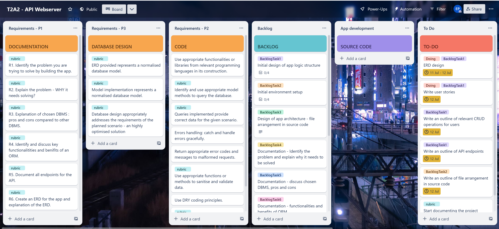

**Day 3**: Work on R1 and refine the ERD.

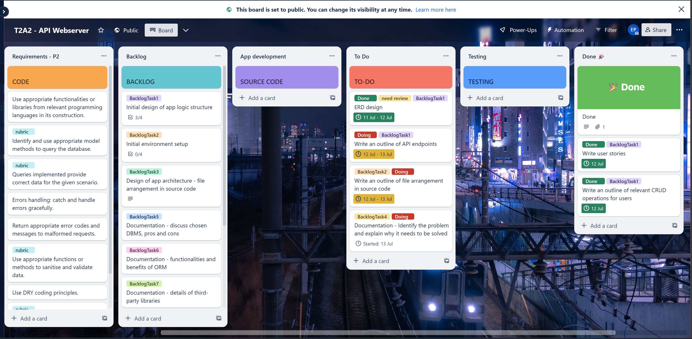

**Day 4**: Complete R1, R2, R3, keep refining the ERD and planning on API endpoints. Start on R4 and complete initial app setup.

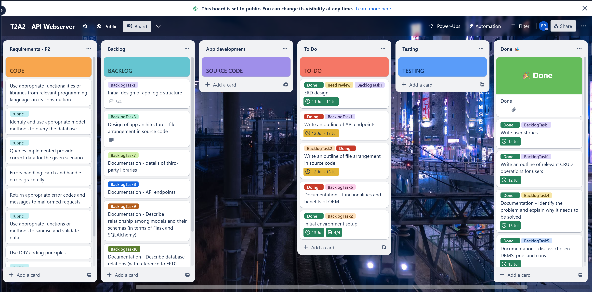

**Day 5**: Complete initial app setup, complete a rough outline of API endpoints. Create a card for standby tasks, as these tasks needs to be touched up and illustrated with actual codes snippets. These tasks are to be revisited when code is written. Move the completed backlog tasks back to backlog card to review one more time once everything is done. 

### Subtasks of Code Writing and Testing

- Write an outline of file arrangements in the source code
- Initial environment setup includes creating virtual environment, app initialization and configuration,installation of required dependencies, creating PostgresSQL database and creating Git repository
- Test the landing page
- Make sure each feature is created off a different feature branch, merge the feature branch to main branch each time one feature is done.
- Create models and schemas, CLI commands and controllers for routes
- Perform API test with Insomnia every time a route is created
- Implement data validation and error handling in all possible scenarios
- Implement authorization on relevant routes based on functionality requirements
- Perform test throughout the development process
- Code comments are added along the way
- API endpoints (R5) are being documented alongside with code writing and testing

See the below screenshots of tasks tracking on Trello for Phase 2 (Day 6 to Day 10):

**Day 6**: Start coding. Create `UserRole` and `User` models and schemas. Create CLI commands for creating, dropping tables and seeding data to `roles` and `users` tables. Start working on user authentication, create routes for user register and login.

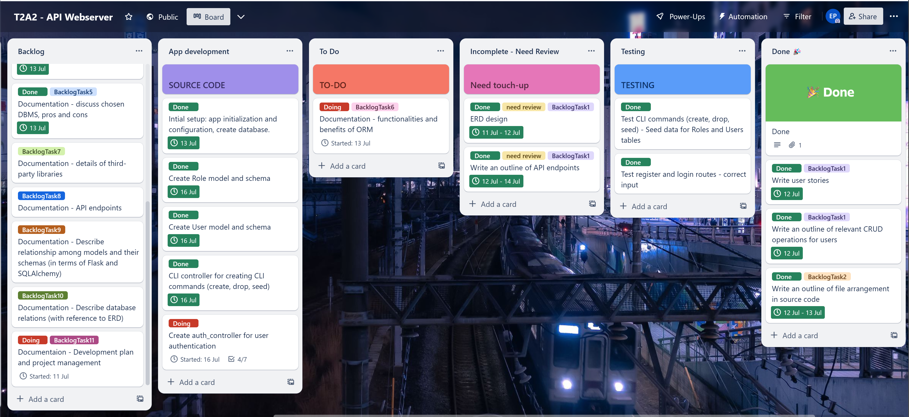
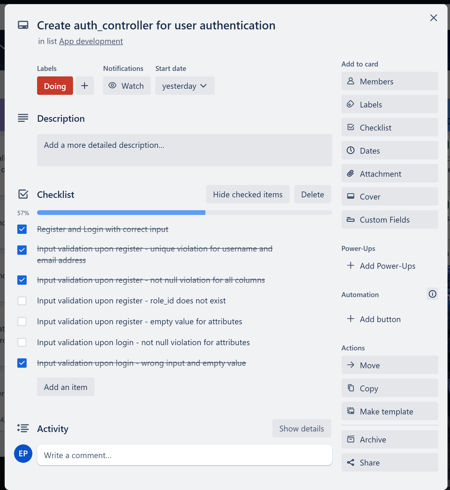

**Day 7**: Complete routes for authentication, including data validation upon registration. Still working on enhancements for data validation, such as relevant error messages and error handling for missing attribute when logging in.

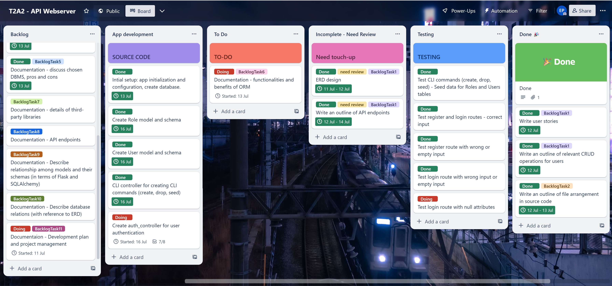

**Day 8**: Complete error handling for authentication routes. Complete routes for users (admin used only), including getting all users, getting one user with full info access an deleting one user. Complete two routes for tourist account owners only: getting one tourist account (full info access) and updating tourist account, including data validation and authorisation. 

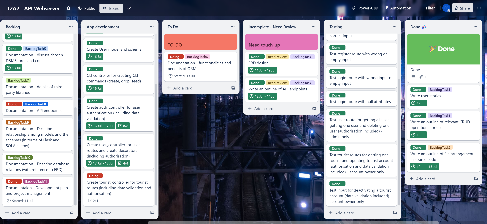

**Day 9**: Create `Tour` and `TourBooking` models and schemas. Seed data to `tours` and `tour_bookings` tables. Complete two routes for tour guide account owners: getting one tour guide account (full info access) and updating a tour guide account, including data validation and authorisation. 

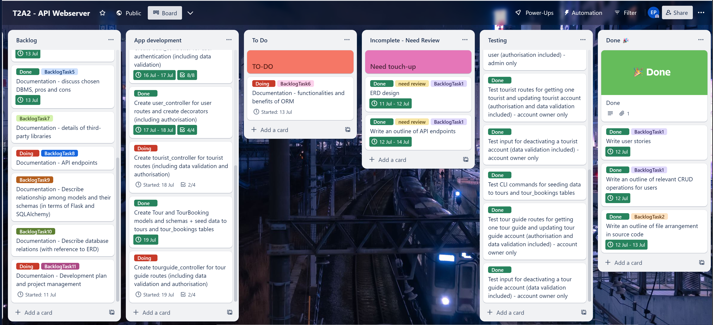

**Day 10**: Complete routes for tours, including Create, Update and Delete functionalities for tour owners and Read functionality for other users (tours are viewed without any booking info). Data validation and authorisation included. 

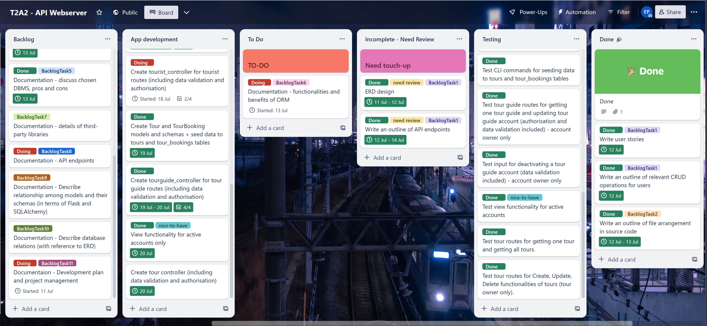

**Day 11**: Complete routes for tour bookings, including Create functionality for tourists, Update and Delete functionalities for the booking owner and Read functionality for only the tourist and the tour guide involved in the booking. Add a route for viewing all tours with full booking info for admin user. 

Go back to work with the remaining tourist routes and tour guide routes, including:
- A route for a tour guide to view one tourist who booked one of their tours
- A route for a tour guide to view all their tour bookings
- A route for a tourist to view all their tour bookings

Rearrange cards in Trello for easier tracking, documentation for API endpoints and tasks tracking are being updated alongside with code. 

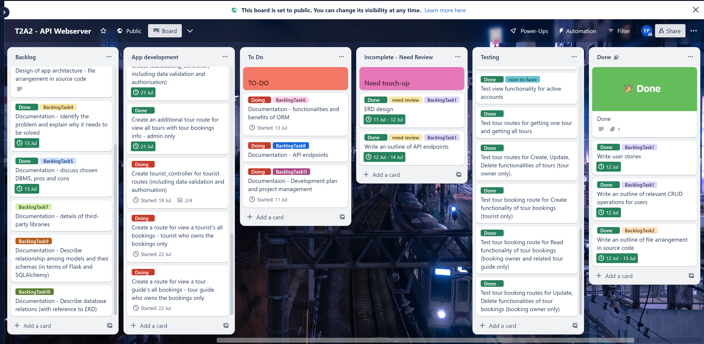

**Day 12**: Complete the above three routes: a route for a tour guide to get one of their tourists (limited access), a route for a tour guide to view all their bookings and a route for a tourist to view all their bookings. Add extra authorisation for admin to delete a tour, a tour bookings and handle IntegrityError when deleting user with current bookings. Rename a few routes. Start working on Review feature. 

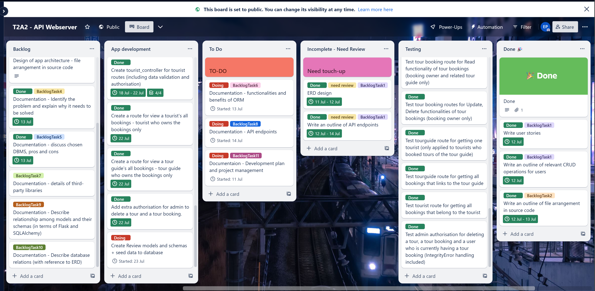

**Day 13**: Complete Review model and schema. Complete review controller for Create, Read, Update, Delete functionalities of reviews, including data validation and authorisation. Add some enhancements to code, such as adding more complex password validation, adding `is_available` attribute to `tours` table, adding restriction for preventing duplication of tour booking. Start working on refining code comments and finishing API endpoints. 

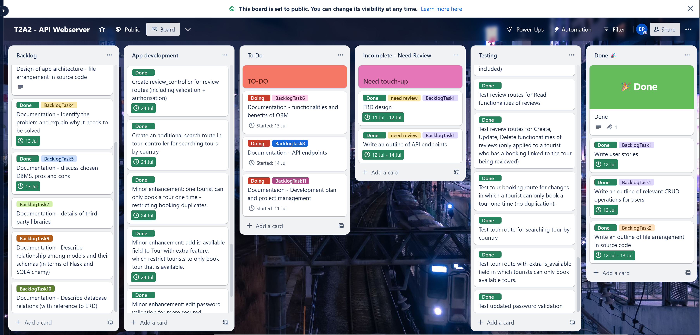

**Day 14**: Complete code comments refinements and API endpoints documentation. Start working on R7 and R8 of the assignment requirements. 

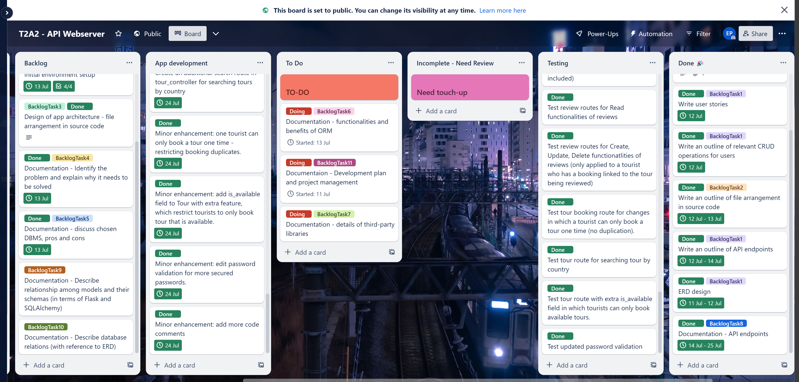

**Day15**: Complete R7 and R8 of the assignment requirements. Add an installation guideline. Add code enhancement for account owners to change password, username and email. Start on R9 and R10 of the assignment requirements. 

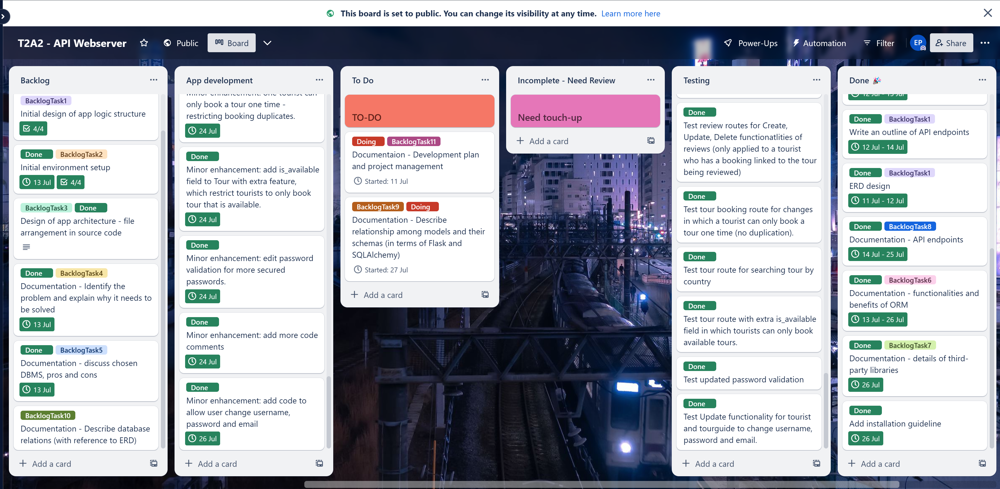

### Subtasks of Documenting

- Complete R4, R7, R8, R9 of the assignment requirements after code is done
- R10 (tasks tracking) is being documented alongside with every step of the development process
- Finish up documentation by checking if all rubric requirements are ticked off to some extent. 

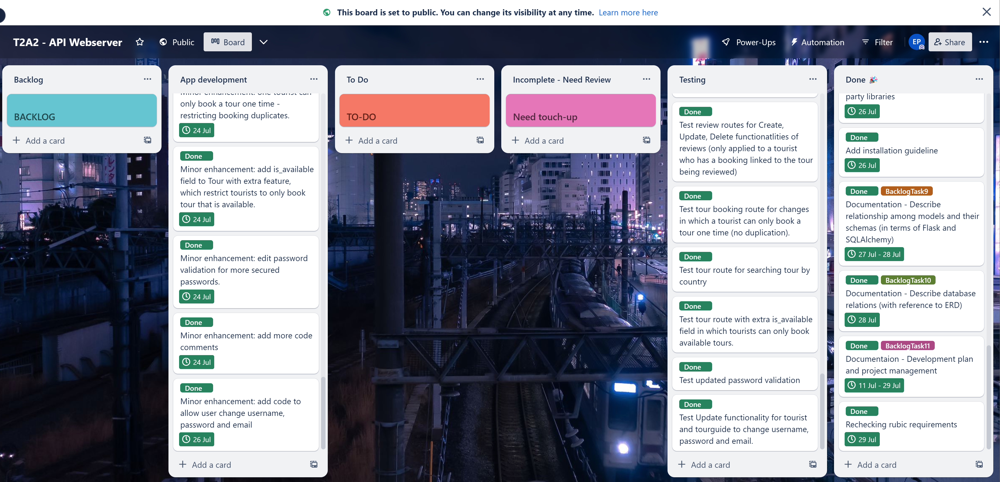

