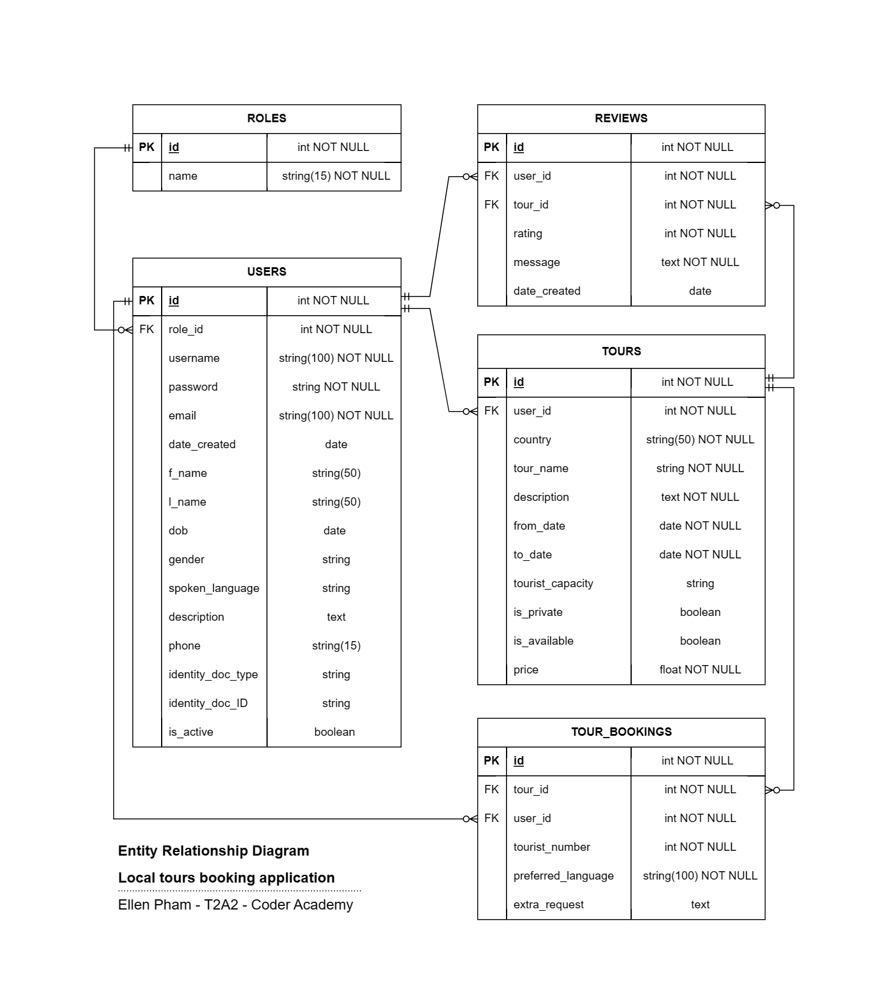

# Identification of the problem and why it needs solving

API Webserver Project: backend development using Python-Flask as web framework and PostgresSQL as database management system.

[GitHub repository](https://github.com/ellenpham/API_Webserver_LocalTourBookingWebApp)

The purpose of this application is to to provide an alternative to the traditional method of travel guide, which is usually provided through the service of travel agencies. This application creates a platform where tourists can find a local tour guide for their upcoming overseas trips and for self-employed tour guides to offer their tours to tourists all around the world without the need of a travel agency. All interactions and transactions between tourists and tour guides are 100% self-operating, the application only acts as a facilitating tool or a networking system. 

The problem to which this application is the solution, is based on the increasing trend for cultural immersion experience in travelling. Nowadays, travelling is not just a getaway trip, to many people, travelling is to explore different horizons, to gain insights and connect with people from different backgrounds, make the trip a memorable experience. The best way is to have a local tour guide who has the most authentic experience, who can offer a unique and personalized experience. Even self-guided tourists might find it helpful to have a local tour guide, who can give tips that save them from costly and timely experience. 

On the other hand, self-employed tour guides can also benefit from the platform, as they can offer the tours designed based on their own capabilities, flexibly schedule the timeframe, especially if this serves as side job. Most importantly, there is no need for an intermediary agent, it means all communications and transactions between tourists and tour guides are direct and open, this helps establish a mateship between them prior to the trips and even after. 

## Problems to be solved

Now we know the purposes for building the application, we further break down the problems that need solving to achieve those purpose. First, a list of user stories was created to be the foundation for developing the application features. Based on the user stories, an outline of CRUD functionalities is created as part of functionality requirements. These functionality requirements are the problems needed to be solved within the scope of this application.

## User stories

View user stories [here](docs/user_stories.md)

## Functionality requirements

#### CRUD functionalities for tourists
- Tourist account owner:
    - Register/Log in
    - Create/View/Update their own account with full privileges
    - Deactivate their own account
    - View a tour guide account with limited access to information 
    - View tours
    - Create/View/Update/Delete a tour booking with full privileges (assuming that the privilege to Delete complies with a cancellation policy based on mutual agreement)
    - Create/View/Update/Delete their own reviews with full privileges (can only review the tours they have booked)
    - View other tourists' reviews

#### CRUD functionalities for tour guides
- Tour guide account owner:
    - Register/Log in 
    - Create/View/Update their own account with full privileges
    - Deactivate their own account
    - View a tourist account with limited access to information (only applied for tourists who have booked their tours)
    - Create/View/Update/Delete their own tours with full privileges (only can Delete a tour if it has not been booked)
    - View tour bookings (only applied for their own tours)
    - View tourists' reviews
    - Nice-to-have: extra feature for tour guides to write reviews to tourists

#### CRUD functionalities for admins
- Admin account owner:
    - View all information with full info: user accounts, tours, tour bookings, reviews
    - Delete all information: user accounts, tours, tour bookings, reviews

Other functionality requirements include:

- Data security: by using authentication mechanism upon login requests and authorization mechanism for granting privileges to relevant users.

- Data integrity and accuracy: by validating and sanitizing incoming data and handling exceptions for graceful response to errors.

<br>

# Database Management System

PostgresSQL is the database management system used in this application. 

*Advantages*

- The database used in the application is relational database, where different entities in the database are mostly related to each other. PostgresSQL is one of the most popular relational database management system (RDBMS), which help manage data in a secure, rules-based and consistent way. 
- It is known for its reliability, extensibility, availability, scalability as well as performance and data security. All these factors are important as this application will be operated based on the exchanging interactions of users and there will be sensitive data involved. 
- Cross-platform and extensive language support it is compatible with Python programming language, which is the language used for this application's web framework. Cross-platform support is also required as this application will be used from worldwide users and most likely by mobile devices.
- Open source and strong community support: it is free, well maintained and supported by strong community of developers, its documentation is comprehensive and informative.
- Full ACID compliance which helps ensure data validity and integrity.
- Advanced data types and processing with a rich set of built-in data types.

*Disadvantages*

- PostgresSQL as a RDBMS is more complex compared to other NoSQL database system like MongoDB. In the early phase of development, data modelling with reasonable normalisation level is required before getting built with PostgresSQL to avoid further modifications which can be complicated. 

- PostgresSQL is lightly slower than MySQL for read-only commands but it is faster for handling massive data sets, complicated queries, and read-write operations. Ultimately, speed will depend on the way you’re using the database ([Integrate.io](https://www.integrate.io/blog/postgresql-vs-mysql-which-one-is-better-for-your-use-case/)).

- Installation and configuration is more complex than MySQL. MySQL has more user-friendly interface, it is simpler to set up and manage.

<br>

# ORM - Key functionalities and benefits

ORM stands for Object Relational Mapping, it is used for interaction between an application and a database. Instead of plain SQL, it is written in the programming language used to code the application, hence, make it easier to develop the database without switching back and forth with SQL queries to interact with database. In another word, ORM allows developers to write queries using the object-oriented paradigm of preferred programming language, this facilitates the integration of database entities as classes in object-oriented programming applications, or as models in MVC applications. In this application, SQLAlchemy is used as Object Relational Mapper and Flask-SQLAlchemy is the Flask extension that adds support for SQLAlchemy to the Flask application ([pythonbasics.org](https://pythonbasics.org/flask-sqlalchemy/)).

### Key functionalities of ORM

As mentioned earlier, SQLAlchemy is the ORM used to connect Flask and PostgresSQL. Therefore, in the scope in this project, we will use examples of SQLAlchemy and PostgresSQL in discussing ORM and the corresponding SQL.

**Create a model**

ORM helps create a model as a class, from which we can create objects/entities and establish the tabular structure of entities in the database. Similar to a table in SQL, where rows are records and columns are attributes/fields. With ORM, we can also define them using variables within a class. 

Models and routes are modularized by using different `.py` files for different models. This makes it easier to import the models as modules when needed. 

```
class Review(db.Model):
    __tablename__ = 'reviews'

    id = db.Column(db.Integer, primary_key=True)
    rating = db.Column(db.Integer, nullable=False)
    message = db.Column(db.Text, nullable=False)
    date_created= db.Column(db.Date, default=date.today())
```

The above example illustrates how a table is created using ORM. Review is the database model which is created as a Review class. `__tablename__` is used to refer the model to `reviews` table in the database. In the `reviews` table, there are following columns `id`, `rating`, `message` and `date_created` and these variables within the Review class are defined as columns using `db.Column`. Similar to SQL, data types and constraints of an attribute can also be defined using ORM.

Also, foreign keys are defined as below when using ORM:

```
user_id = db.Column(db.Integer, db.ForeignKey('users.id'), nullable=False)
```

To create the associations between tables, the below ORM syntax is used. In this case, the relationship between `user` and `reviews` is one-to-many relationship, and it is established using `db.relationship`.

In `review..py`
```
user = db.relationship('User', back_populates='reviews')
```
In `user.py`

```
reviews = db.relationship('Review', back_populates='user', cascade='all, delete')
```

With PostgresSQL, this could be written as below:

```
CREATE TABLE REVIEWS (
    id integer PRIMARY KEY,
    rating integer NOT NULL,
    message text NOT NULL, 
    date_created date DEFAULT CURRENT_DATE,
    user_id integer NOT NULL,
    FOREIGN KEY(user_id) REFERENCES USERS(id) ON DELETE CASCADE
);
```

**CLI commands**

The data seeding is done using the ORM functionality of CLI commands. The syntax to create a CLI command is `@db_commands.cli.command('create')` and it will invoke the `create_db` function. It acts similarly as `CREATE TABLE` in SQL. The `DROP TABLE` operation is done the same way using `@db_commands.cli.command('drop')`. 

```
db_commands = Blueprint('db', __name__)

@db_commands.cli.command('create')
def create_db():
    db.create_all()
    print('Table created')
```

The seeding operation is similar to `INSERT`. A record in the table is an instance of the class and it is seeded to the database as below: 

```
@db_commands.cli.command('seed')
def seed_db():
    review = Review(
        id = '1',
        rating = '5',
        message = 'Lorem ipsum dolor sit amet',
        date_created = date.today(),
        user_id = '1',
    )
    db.session.add(review)
    db.session.commit()
```

With PostgresSQL, this could be written as below:

```
INSERT INTO reviews(id, rating, message, date_created, user_id) VALUES (2, 5, 'Lorem ipsum dolor sit amet', DEFAULT, 1);
```

To execute these operations, we run the following commands in the terminal: `flask create`, `flask drop` and `flask seed`. In this case, because a Blueprint is used for the purpose of organizing routes, therefore, the CLI commands are run in the terminal as `flask db create`, `flask db drop` and `flask db seed`.

**Data manipulation**

ORM also supports other SQL commands for data manipulation such as `SELECT`, `DELETE`, `UPDATE`, SQL queries clauses such as `WHERE`, `GROUP BY`, `ORDER BY`, etc and multi-table queries (subqueries and join tables). Below are some examples:

- Code written using ORM to get all reviews from `reviews` table in an ascending date order:

```
def get_all_reviews():
    stmt = db.select(Review).order_by(Review.date_created.asc())
    reviews = db.session.scalars(stmt)
    return reviews
```

With PostgresSQL, this could be written as below:

```
SELECT * FROM reviews ORDER BY date_created ASC;
```

- Code written using ORM to get the review message from the first review in the `reviews` table:

```
def get_one_review():
    stmt = db.select(Review).filter_by(id=1)
    review = db.session.scalar(stmt)
    return review.message
```

In SQL, this could be written as below:

```
SELECT message FROM reviews where id = 1;
```

- Code written using ORM to delete a review:

```
def delete_review():
    stmt = db.select(Review).join(Tour).filter(and_(Tour.id==1, Review.id==2))
    review = db.session.scalar(stmt)
    if review:
        db.session.delete(review)
        db.session.commit()
```

With PostgresSQL, this could be written as below using subqueries:

```
DELETE FROM reviews
WHERE reviews.id=2 AND tour_id = (SELECT id FROM tours WHERE id='1');
```

There are many available ORM tools for OOP languages, such as Django, SQLAlchemy, web2py for Python app, Hibernate, Apache OpenJPA, jOOQ for Java app; Microsoft Entity Framework or Dapper for .NET framework; Laravel, CakePHP or Qcodo for PHP app, etc. They all have the below key features (source: [DEV community](https://dev.to/dak425/what-are-orms-and-why-should-you-use-them-2ng4), [EDUCBA](https://www.educba.com/what-is-orm/) and [freeCodeCamp](https://www.freecodecamp.org/news/what-is-an-orm-the-meaning-of-object-relational-mapping-database-tools/)):

- The application is made independent of the DBMS used in the backend. Therefore, generic queries can be written, which makes it easier for when migrating to another database.
- Developers are not required to learn SQL syntaxes separately for whichever database being used to support the application.
- All small or big changes can be implemented using ORM, no such restrictions in data handling and manipulation.
- The connection are robust and more secure due to less intervention in code.
- ORM also has its shortcoming, it is only recommended for small to mid-sized projects. When very complex queries are involved, ORM is likely not going to perform better. Also, ORM is mainly used for SQL databases, it is not common in NOSQL databases. 


### Key benefits of ORM

- ORM helps simplify the interaction between relational databases and different OOP languages. CRUD operations can be performed with the ORM API without writing raw SQL statements ([pythonbasics.org](https://pythonbasics.org/flask-sqlalchemy/)).
- It supports tasks like transactions, connection pooling, migrations, seeds, etc.
- The implementation is simple and easy to maintain, which helps speed up development time. 
- Less and neater code is written when using ORM than with SQL
- If there are changes in database, the code is not likely to change or just needs minor changes.
- Security is improved as ORM tools are built with the idea of data abstraction, which helps prevent the risk of SQL injection attacks ([freeCodeCamp](https://www.freecodecamp.org/news/what-is-an-orm-the-meaning-of-object-relational-mapping-database-tools/)).
- Queries via ORM can be written irrespective of whatever database one is using in the backend, which provides flexibility to developers. ([EDUCBA](https://www.educba.com/what-is-orm/)).

<br>

# API endpoints documentation

## App installation

### System prerequisites

- Python Version 3x is required to run the application. If Python has not been installed in your computer, please download by following [this link](https://www.python.org/downloads/).

- Git Setup is required to be able to clone the repo to your computer, follow [this link](https://git-scm.com/book/en/v2/Getting-Started-First-Time-Git-Setup) to set up Git. Alternatively, you can download zip file to your computer by going to my [GitHub repo](https://github.com/ellenpham/API_Webserver_LocalTourBookingWebApp), click into **Code**, then **Download ZIP**.

- PostgresSQL is required for this applcation as database management system. If PostgresSQL has not been installed in your computer, please download and install by following [this link](https://www.postgresql.org/download/).

### Installation steps

In your computer, open terminal or command prompt:

- Change the directory to a folder where you want to download the app using `cd <directory>`

- Clone this repository using `git clone https://github.com/ellenpham/API_Webserver_LocalTourBookingWebApp`

- Change the directory to the `src` folder using `cd ./MyPham_T2A2/src`

- To activate the virtual environment, use the following command `source .venv/bin/activate`

- If `.venv` does not exist, follow the below commands to set up the virtual environment:

    ```    
    python3 -m venv .venv
    source .venv/bin/activate
    ```

- Install the dependencies, using `pip3 install -r requirements.txt`

- In another terminal window, start your PostgresSQL service and run `psql` to access the database management system. Create database in your PostgresSQL by following the configuration in the `.env` folder to set up the database URL and JWT

- To create the initial database for API testing run the following CLI commands in order: `flask db drop`, `flask db create`, `flask db seed`

- Once the database is all set up, run the following SQL commands to check if the data has been seeded successfully:

    ```
        \c <db_name>
        \dt
        SELECT * FROM <table_name>
    ```

- Run the app using `flask run`

- Open an API client, follow the API endpoints documentation to implement the test. 


## API client

As this project is developed as an API Webserver, the front-end has not been built for a proper APIs testing. We will need a different tool for sending requests to an API and inspecting the generated response. An API client is the tool to do such query testing, two popular choices are [Postman](https://www.postman.com/downloads/) and [Insomnia](https://insomnia.rest/download), you can choose your preferred one.

## API endpoints

Once Postman or Insomnia is installed, you can create HTTP requests and use the routes, methods and data provided in the below documentation to test the application. 

View the documentation of API endpoints [here](docs/API_endpoints.md)

<br>

# Entity Relationship Diagram (ERD)



<br>

# Third party services used in the app

**Flask** (version 2.3.2)

Flask is a lightweight WSGI web framework, it is a Python library used to make web applications in Python programming language. Here, Flask is used for the controller and model part in the backend when applied in an MVC architecture. Flask provides useful tools and features foe easily develop web apps, it is easy to extend and has a built-in debugger, which shows tracebacks in the browser when an unhandled error happen during a request ([Flask documentation](https://flask-docs.readthedocs.io/en/latest/debugging/#the-built-in-debugger)).

**Psycopg2** (version 2.9.6)

Psycopg2 is used to create the database connection in a Flask app, it is the most common PostgresSQL database adapter for Python programming language. With Psycopg2, Python data types are supported and adapted to match data types in PostgreSQL. Its key features are the complete implementation of the Python DB API 2.0 specifications, especially thread safety. Psycopg2 is both efficient and secure because it was built around libpq, a PostgreSQL client library, which performs the majority of network communications and returns query results in C structures. ([PyPI](https://pypi.org/project/psycopg2/)).

**SQLAlchemy** (version 2.0.18)

SQLAlchemy is a Python SQL toolkit and an Object Relational Mapper (ORM). It provides developers the full power and flexibility to access database access in relational databases. SQLAlchemy as an ORM is used to make queries and handle data using simple Python objects and methods. In this application, Flask-SQLAlchemy (version 3.0.5) is also installed. It is an extension for Flask, which provides methods and tools to interact with database in Flask apps through SQLAlchemy. It simplifies the use of SQLAlchemy with Flask by setting up objects and patterns to use those objects such as sessions tied to web requests, models and engines ([DigitalOcean](https://www.digitalocean.com/community/tutorials/how-to-use-flask-sqlalchemy-to-interact-with-databases-in-a-flask-application), [Flask-SQLAlchemy documentation](https://flask-sqlalchemy.palletsprojects.com/en/3.0.x/)).

**bcrypt**


**Marshmallow**

**Flask-JWT-extended**